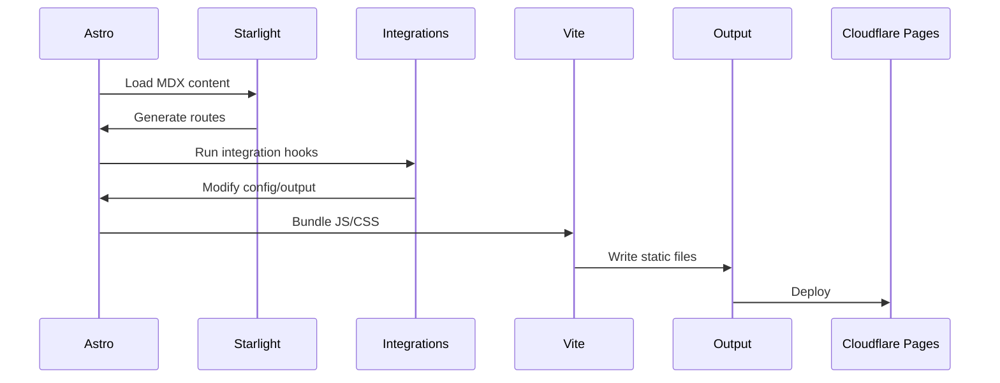

# Build and Deployment

## Build Commands

| Command        | Description                                  |
| -------------- | -------------------------------------------- |
| `pnpm dev`     | Start development server on `localhost:4321` |
| `pnpm build`   | Build production static site to `dist/`      |
| `pnpm preview` | Preview built site locally                   |
| `pnpm clean`   | Remove `.astro/` cache and `dist/` output    |

## Build Process

The build process uses Astro's static site generation with custom integrations:

### Vite Build Configuration

In `.config/astro.config.mjs`:

- **Minification**: Terser with `drop_console`, `drop_debugger`, `passes: 2`
- **Code Splitting**: Manual chunks for `@astrojs/starlight`
- **Output Naming**: `chunks/[name]-[hash].js`, `entry/[name]-[hash].js`, `assets/[name]-[hash].[ext]`
- **Cache**: `.vite-cache` directory

### Custom Integrations During Build

1. **filter-known-build-warnings** (`src/integrations/filter-known-build-warnings.ts`)
    - Wraps `console.warn`, `process.stdout.write`, `process.stderr.write`
    - Filters benign warnings like Starlight 404 routing conflicts
    - Prevents console pollution during build

2. **critical-css** (`src/integrations/critical-css.ts`)
    - Reads `src/styles/critical.css`
    - Inlines CSS into `<head>` of every generated HTML file
    - Improves First Contentful Paint (FCP)

3. **cloudflare-static-headers** (`src/integrations/cloudflare-static-headers.ts`)
    - Generates `dist/_headers` file
    - Applies security headers and cache policies per path pattern
    - Uses `src/config/security.ts` for header definitions

4. **cloudflare-redirects** (`src/integrations/cloudflare-redirects.ts`)
    - Generates `dist/_redirects` file
    - Maps Astro's `redirects` config to Cloudflare Pages format
    - Handles 47+ legacy URL redirects

## Deployment

### Cloudflare Pages Configuration

- **Build Command**: `pnpm build`
- **Output Directory**: `dist/`
- **Environment**: Node.js 22+ (from `package.json` engines)
- **Wrangler Config**: `wrangler.json` with `nodejs_compat` flag

### Static File Generation

The build produces:

- `dist/index.html` - Home page
- `dist/_headers` - Security headers and cache policies
- `dist/_redirects` - URL redirect rules
- `dist/_astro/*` - Bundled JavaScript and CSS assets
- `dist/pagefind/*` - Search index files
- `dist/manifest.json` - PWA manifest
- `dist/sw.js` - Service worker
- `dist/offline.html` - Offline fallback page

## CI/CD Workflows

GitHub Actions workflows in `.github/workflows/`:

### ci-cd.yml (5834 bytes)

Main CI/CD pipeline:

- Triggers on push to main and pull requests
- Installs dependencies with pnpm
- Runs linting and type checking
- Builds the site
- Runs unit tests (Vitest)
- Deploys to Cloudflare Pages

### collect-metrics.yml (1414 bytes)

Automated metrics collection:

- Runs `scripts/collect-github-metrics.mjs`
- Updates `src/data/metrics/project-progress.json`
- Commits changes back to repository

### notify-collaboration.yml (10474 bytes)

Collaboration notifications:

- Triggers on pull request events
- Sends notifications to Feishu webhook
- Sends notifications to WeCom webhook
- Includes PR details and review status

### project-automation.yml (4498 bytes)

GitHub Projects automation:

- Triggers on issue events
- Adds issues to GitHub Projects board
- Updates project status based on issue state

### openwiki-update.yml (2250 bytes)

OpenWiki documentation updates:

- Triggers on documentation changes
- Runs OpenWiki ingestion
- Updates documentation wiki

## Quality Checks

### Bundle Budget

`scripts/quality/check-bundle-budget.mjs` enforces size limits:

| Metric          | Budget | Environment Variable          |
| --------------- | ------ | ----------------------------- |
| Total JS        | 380 KB | `BUNDLE_BUNDLE_TOTAL_JS_KB`   |
| Total CSS       | 180 KB | `BUNDLE_BUDGET_TOTAL_CSS_KB`  |
| Single JS file  | 100 KB | `BUNDLE_BUDGET_SINGLE_JS_KB`  |
| Single CSS file | 95 KB  | `BUNDLE_BUDGET_SINGLE_CSS_KB` |

Run with: `pnpm quality:bundle`

### Lighthouse CI

`.config/lighthouserc.json` configures Lighthouse audits:

- Run with: `pnpm quality:lighthouse`
- Asserts performance, accessibility, best practices scores

## Environment Variables

Required environment variables (documented in `.dev.vars.example`):

| Variable               | Purpose                      | Required |
| ---------------------- | ---------------------------- | -------- |
| `UMAMI_WEBSITE_ID`     | Umami Analytics tracking     | Optional |
| `GITHUB_CLIENT_ID`     | GitHub OAuth authentication  | Optional |
| `GITHUB_CLIENT_SECRET` | GitHub OAuth authentication  | Optional |
| `QQ_APP_ID`            | QQ authentication            | Optional |
| `QQ_APP_KEY`           | QQ authentication            | Optional |
| `VAPID_PUBLIC_KEY`     | Push notification VAPID keys | Optional |
| `VAPID_PRIVATE_KEY`    | Push notification VAPID keys | Optional |
| `FEISHU_WEBHOOK_URL`   | Feishu notifications         | Optional |
| `WECOM_WEBHOOK_URL`    | WeCom notifications          | Optional |
| `UPTIME_ROBOT_API_KEY` | Uptime monitoring            | Optional |

## Related Pages

- [Architecture Overview](./overview.md)
- [Security Configuration](../configuration/security.md)
- [Development Scripts](../operations/scripts.md)
- [GitHub Actions](../operations/github-actions.md)
