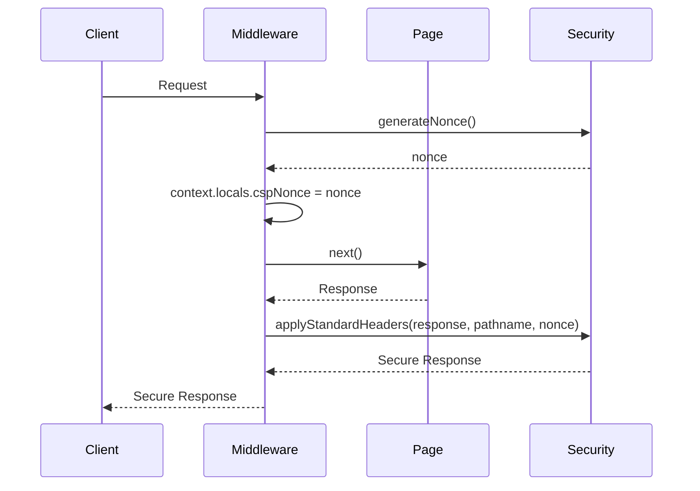

# Request Middleware

The middleware processes every request to generate a unique CSP nonce and apply security headers.

## Implementation

`src/middleware.ts` (593 bytes):

```typescript
import { defineMiddleware } from 'astro:middleware'
import { applyStandardHeaders, generateNonce } from './config/security'

export const onRequest = defineMiddleware(async (context, next) => {
    const { pathname } = context.url

    // Generate CSP nonce (unique per request)
    const nonce = generateNonce()

    // Store nonce in locals for page access
    ;(context.locals as Record<string, unknown>).cspNonce = nonce

    const secureResponse = (response: Response) => applyStandardHeaders(response, pathname, nonce)

    return secureResponse(await next())
})
```

## Flow



## Nonce Generation

```typescript
export function generateNonce(): string {
    const array = new Uint8Array(16)
    crypto.getRandomValues(array)
    return Array.from(array, (b) => b.toString(16).padStart(2, '0')).join('')
}
```

- 16 bytes (128 bits) of cryptographic randomness
- Hex-encoded to 32 characters
- Unique per request

## Header Application

```typescript
export function applyStandardHeaders(
    response: Response,
    pathname: string,
    nonce: string
): Response {
    const headers = new Headers(response.headers)

    // Apply security headers
    for (const header of securityHeaders) {
        if (!headers.has(header.name)) {
            headers.set(header.name, header.value)
        }
    }

    // Apply cache control
    const cacheControl = getCacheControlHeader(pathname)
    headers.set('Cache-Control', cacheControl)

    return new Response(response.body, {
        status: response.status,
        statusText: response.statusText,
        headers,
    })
}
```

## Context Locals

The nonce is stored in `context.locals` for access in pages:

```typescript
interface Locals {
    cspNonce: string
}
```

Pages can access this to add nonce attributes to inline scripts:

```astro
<script nonce={Astro.locals.cspNonce}>
    // This inline script is allowed by CSP
</script>
```

## Integration with Astro

Middleware is automatically loaded by Astro from `src/middleware.ts`.

No configuration required - Astro discovers and runs it on every request.

## Related Pages

- [Security Configuration](../configuration/security.md)
- [Astro Configuration](../configuration/astro-config.md)
- [PWA and Offline Support](../features/pwa.md)
