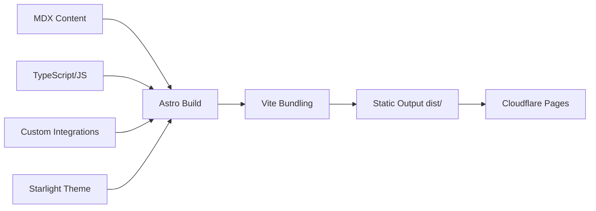
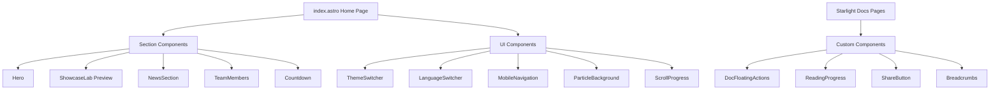
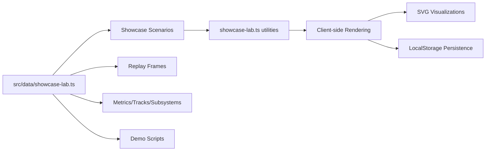
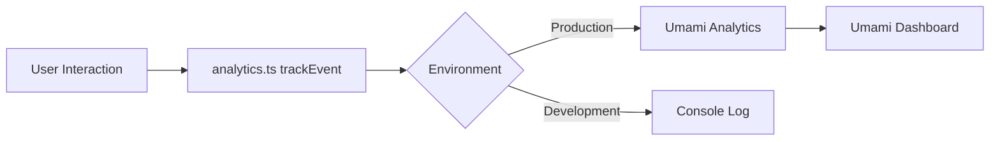

# Architecture Overview

The HUAT FSAC documentation site is a statically-generated website built with **Astro 7.x** and **Starlight 0.41.x**, deployed to **Cloudflare Pages**. It provides bilingual (Chinese/English) documentation for the Formula Student Autonomous Competition team.

## Technology Stack

| Layer               | Technology                                                  |
| ------------------- | ----------------------------------------------------------- |
| Framework           | Astro 7.x (static site generator)                           |
| Documentation Theme | Starlight 0.41.x                                            |
| Language            | TypeScript 5.x                                              |
| Build Tool          | Vite 6.x                                                    |
| Deployment          | Cloudflare Pages (static)                                   |
| Package Manager     | pnpm 9.x                                                    |
| CSS                 | Custom CSS (docs-global.css, critical.css, code-blocks.css) |
| Search              | Pagefind (static index)                                     |
| Analytics           | Umami Analytics                                             |
| Comments            | Giscus (GitHub Discussions)                                 |

## Build Pipeline

The build process transforms MDX content and Astro components into static HTML:



### Build Steps

1. **Content Loading**: Starlight's `docsLoader()` reads MDX files from `src/content/docs/`
2. **Schema Validation**: `docsSchema()` validates frontmatter structure
3. **Integration Hooks**: Custom integrations run during build:
    - `filter-known-build-warnings` - Filters benign console warnings
    - `critical-css` - Inlines critical CSS into HTML `<head>`
    - `cloudflare-static-headers` - Generates `_headers` file
    - `cloudflare-redirects` - Generates `_redirects` file
4. **Vite Bundling**: JavaScript and CSS are bundled with terser minification
5. **Output**: Static files written to `dist/` directory

### Custom Integrations

Located in `src/integrations/`, these run at build time:

| Integration                   | Hook                                    | Purpose                                                                |
| ----------------------------- | --------------------------------------- | ---------------------------------------------------------------------- |
| `filter-known-build-warnings` | `astro:config:setup`                    | Wraps `console.warn` and stdout/stderr to filter benign warnings       |
| `critical-css`                | `astro:build:done`                      | Reads `src/styles/critical.css` and inlines it in every HTML file      |
| `cloudflare-static-headers`   | `astro:build:done`                      | Generates Cloudflare Pages `_headers` with security and cache policies |
| `cloudflare-redirects`        | `astro:config:done`, `astro:build:done` | Captures redirects config and generates `_redirects` file              |

## Runtime Architecture

### Client-Side Architecture

The site uses a component-based architecture with Astro islands for interactivity:



### Middleware

The middleware at `src/middleware.ts` runs on every request:

1. Generates a unique CSP nonce via `generateNonce()`
2. Stores nonce in `context.locals.cspNonce` for inline script use
3. Applies security headers via `applyStandardHeaders(response, pathname, nonce)`

### Service Worker

The service worker at `public/sw.js` provides offline support with multiple caching strategies:

| Strategy                 | Content Types          | Behavior                             |
| ------------------------ | ---------------------- | ------------------------------------ |
| `NETWORK_FIRST`          | HTML documents         | Try network first, fallback to cache |
| `CACHE_FIRST`            | CSS, JS, images, fonts | Serve from cache, fetch if missing   |
| `STALE_WHILE_REVALIDATE` | JSON, XML              | Serve cached, update in background   |

Precached assets include: `/`, `/favicon.png`, `/favicon.svg`, `/manifest.json`, `/og-image.png`, `/offline.html`

## Data Flow

### Content Data Flow

```mermaid
flowchart LR
    A[MDX Files in src/content/docs/] --> B[docsLoader()]
    B --> C[Content Collections]
    C --> D[Starlight Schema Validation]
    D --> E[Astro Components]
    E --> F[Static HTML Output]
```

### Showcase Lab Data Flow

The interactive showcase lab has a separate data pipeline:



### Analytics Data Flow



## File Organization

```
Guidance-Astro/
├── .config/             # Centralized configuration
│   ├── astro.config.mjs # Main Astro config
│   ├── sidebar.mjs      # Navigation structure
│   ├── eslint.config.mjs
│   ├── vitest.config.ts
│   └── playwright.config.ts
├── public/              # Static assets
│   ├── manifest.json    # PWA manifest
│   ├── sw.js            # Service worker
│   └── offline.html     # Offline fallback
├── src/
│   ├── components/      # Astro components
│   │   ├── home/        # Home page sections and UI
│   │   ├── docs/        # Documentation components
│   │   ├── navigation/  # Navigation components
│   │   └── overrides/   # Starlight component overrides
│   ├── content/         # Content collections
│   │   ├── docs/        # MDX documentation
│   │   ├── i18n/        # Translation files
│   │   └── docs-center/ # Documentation center
│   ├── data/            # Data files
│   ├── integrations/    # Custom Astro integrations
│   ├── middleware.ts    # Per-request middleware
│   ├── pages/           # Astro pages
│   ├── styles/          # CSS files
│   ├── types/           # TypeScript types
│   └── utils/           # Utility modules
├── scripts/             # Build/optimization scripts
└── tests/               # Test files
```

## Related Pages

- [Build and Deployment](./build-deployment.md)
- [Showcase Lab Architecture](./showcase-lab.md)
- [Security Configuration](../configuration/security.md)
- [Internationalization](../configuration/i18n.md)
