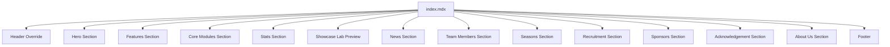

# Home Page Structure

The home page is rendered by `src/content/docs/index.mdx` which imports and composes multiple section components.

## Page Layout



## Section Components

All section components are in `src/components/home/sections/`:

| Component          | File                                    | Purpose                               |
| ------------------ | --------------------------------------- | ------------------------------------- |
| Hero               | `Hero.astro` (7102 bytes)               | Hero banner with background slideshow |
| Features           | `Features.astro` (3405 bytes)           | Feature highlights                    |
| CoreModules        | `CoreModules.astro` (8719 bytes)        | Core module showcase                  |
| Stats              | `Stats.astro` (4629 bytes)              | Statistics counters                   |
| ShowcaseLab        | `ShowcaseLab.astro` (9709 bytes)        | Interactive lab preview               |
| NewsSection        | `NewsSection.astro` (1989 bytes)        | Latest news                           |
| TeamMembers        | `TeamMembers.astro` (2411 bytes)        | Team member showcase                  |
| Seasons            | `Seasons.astro` (9077 bytes)            | Season history                        |
| Recruitment        | `Recruitment.astro` (6820 bytes)        | Recruitment info                      |
| Sponsors           | `Sponsors.astro` (4975 bytes)           | Sponsor display                       |
| Acknowledgement    | `Acknowledgement.astro` (5485 bytes)    | Acknowledgements                      |
| AboutUs            | `AboutUs.astro` (2752 bytes)            | About us section                      |
| Countdown          | `Countdown.astro` (6461 bytes)          | Race countdown timer                  |
| Achievement        | `Achievement.astro` (8580 bytes)        | Team achievements                     |
| FormulaStudentInfo | `FormulaStudentInfo.astro` (6446 bytes) | Formula Student info                  |
| JoinUs             | `JoinUs.astro` (2383 bytes)             | Join us CTA                           |
| ImageCarousel      | `ImageCarousel.astro` (3104 bytes)      | Image carousel                        |
| NewsCard           | `NewsCard.astro` (4213 bytes)           | News card component                   |
| SectionCarousel    | `SectionCarousel.astro` (2871 bytes)    | Section carousel                      |
| Showcase           | `Showcase.astro` (7475 bytes)           | Showcase display                      |

## Data Sources

### Home Data (`src/data/home.ts`, 15924 bytes)

Exports configuration objects:

```typescript
export const heroConfig = {
    title: 'HUAT FSAC',
    subtitle: '方程式赛车队',
    description: '...',
    ctaText: '开始探索',
    ctaLink: '/2024-learning-roadmap/',
    backgroundImages: ['/assets/photo-together.jpg', '/assets/2023.jpg', '/assets/2022.jpg'],
}

export const stats: StatItem[] = [...]
export const achievements: AchievementItem[] = [...]
export const sponsors: SponsorGroup[] = [...]
export const news: NewsItem[] = [...]
export const seasons: SeasonItem[] = [...]
```

### Data Types

```typescript
interface StatItem {
    value: string
    label: string
    icon?: string
}

interface AchievementItem {
    badge?: string
    title: string
    description: string
    ctaText: string
    ctaLink: string
    image: string
}

interface SeasonItem {
    year: string
    carImg: string
    explainImg: string
    advisor?: string
    captain?: string
    members?: { group: string; names: string[] }[]
}

interface NewsItem {
    title: string
    description: string
    image: string
    link: string
    date?: string
}
```

## UI Components

Interactive UI components in `src/components/home/ui/`:

| Component          | File                                   | Purpose                 |
| ------------------ | -------------------------------------- | ----------------------- |
| BackToTop          | `BackToTop.astro` (3460 bytes)         | Scroll to top button    |
| KeyboardNav        | `KeyboardNav.astro` (5406 bytes)       | Keyboard navigation     |
| LanguageSwitcher   | `LanguageSwitcher.astro` (5521 bytes)  | Language switching      |
| MobileNavigation   | `MobileNavigation.astro` (10577 bytes) | Mobile menu             |
| ParallaxScroll     | `ParallaxScroll.astro` (402 bytes)     | Parallax scrolling      |
| ParticleBackground | `ParticleBackground.astro` (803 bytes) | Particle animation      |
| ScrollProgress     | `ScrollProgress.astro` (2035 bytes)    | Scroll progress bar     |
| ScrollReveal       | `ScrollReveal.astro` (416 bytes)       | Scroll reveal animation |
| ThemeSwitcher      | `ThemeSwitcher.astro` (22338 bytes)    | Theme switching UI      |

## Component Conflict Invariants

E2E tests in `tests/e2e/component-conflict.spec.ts` (9370 bytes) prove critical invariants:

### Theme Switcher Exclusivity

- On home page: `.theme-switcher` count is 1 (home ThemeSwitcher)
- On docs pages: `.theme-switcher` count is 0 (docs uses DocFloatingActions)

### Progress Bar Mutual Exclusivity

- On home page: `.scroll-progress` visible, `.reading-progress-bar` hidden
- On docs pages: `.scroll-progress` hidden, `.reading-progress-bar` visible

## Hero Section

The Hero component (`src/components/home/sections/Hero.astro`) features:

- Background image slideshow with parallax effect
- Preloaded first image for performance
- CTA button with prefetch
- Responsive design

### Background Images

Configured in `heroConfig.backgroundImages`:

```typescript
backgroundImages: ['/assets/photo-together.jpg', '/assets/2023.jpg', '/assets/2022.jpg']
```

## Showcase Lab Preview

The ShowcaseLab section on the home page provides a preview of the interactive dashboard:

```typescript
interface ShowcaseContent {
    href: string
    title: string
    subtitle: string
    description: string
    features: string[]
    cta: string
    preview: { title: string; subtitle: string }
}
```

Links to `/showcase-dashboard/` for the full interactive experience.

## Related Pages

- [Showcase Lab Architecture](../architecture/showcase-lab.md)
    <!-- openwiki: broken internal link [./home-components.md] file "./home-components.md" does not exist. Fix the href or restore the target, then delete this comment. -->
- [Home Page Components](./home-components.md)
- [Documentation Components](./docs-components.md)
