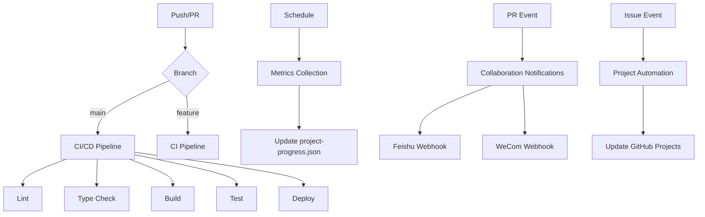

# GitHub Actions Workflows

GitHub Actions workflows in `.github/workflows/`.

## Workflow Overview

| Workflow           | File                       | Size        | Purpose                    |
| ------------------ | -------------------------- | ----------- | -------------------------- |
| CI/CD              | `ci-cd.yml`                | 5834 bytes  | Build, test, deploy        |
| Metrics            | `collect-metrics.yml`      | 1414 bytes  | GitHub metrics collection  |
| Collaboration      | `notify-collaboration.yml` | 10474 bytes | Feishu/WeCom notifications |
| Project Automation | `project-automation.yml`   | 4498 bytes  | GitHub Projects automation |
| OpenWiki           | `openwiki-update.yml`      | 2250 bytes  | Documentation wiki updates |

## CI/CD Workflow

`ci-cd.yml` (5834 bytes)

### Triggers

- Push to `main` branch
- Pull requests to `main`

### Jobs

1. **Install**: Install dependencies with pnpm
2. **Lint**: Run ESLint
3. **Type Check**: Run TypeScript check
4. **Build**: Build the site
5. **Test**: Run Vitest unit tests
6. **Deploy**: Deploy to Cloudflare Pages

### Secrets Required

| Secret                 | Purpose                     |
| ---------------------- | --------------------------- |
| `CLOUDFLARE_API_TOKEN` | Cloudflare Pages deployment |

## Metrics Collection

`collect-metrics.yml` (1414 bytes)

### Triggers

- Scheduled (cron)
- Manual dispatch

### Steps

1. Run `scripts/collect-github-metrics.mjs`
2. Update `src/data/metrics/project-progress.json`
3. Commit changes if modified

## Collaboration Notifications

`notify-collaboration.yml` (10474 bytes)

### Triggers

- Pull request events (opened, closed, merged)
- Pull request review events

### Notifications

#### Feishu Webhook

Sends PR notifications to Feishu:

- PR title and description
- Author information
- Review status
- Merge status

#### WeCom Webhook

Sends PR notifications to WeCom:

- PR title and description
- Author information
- Review status
- Merge status

### Secrets Required

| Secret               | Purpose                     |
| -------------------- | --------------------------- |
| `FEISHU_WEBHOOK_URL` | Feishu notification webhook |
| `WECOM_WEBHOOK_URL`  | WeCom notification webhook  |

## Project Automation

`project-automation.yml` (4498 bytes)

### Triggers

- Issue events (opened, closed, reopened)
- Pull request events

### Actions

- Add issues to GitHub Projects board
- Update project status based on issue state
- Move cards between columns

### Secrets Required

| Secret          | Purpose                      |
| --------------- | ---------------------------- |
| `PROJECT_TOKEN` | GitHub Projects access token |

## OpenWiki Updates

`openwiki-update.yml` (2250 bytes)

### Triggers

- Push to documentation files
- Manual dispatch

### Steps

1. Run OpenWiki ingestion
2. Update documentation wiki

### Secrets Required

| Secret               | Purpose                  |
| -------------------- | ------------------------ |
| `OPENROUTER_API_KEY` | AI documentation updates |

## Workflow Diagram

## Related Pages

- [Build and Deployment](../architecture/build-deployment.md)
- [Environment Configuration](../configuration/environment.md)
- [Development Scripts](./scripts.md)
