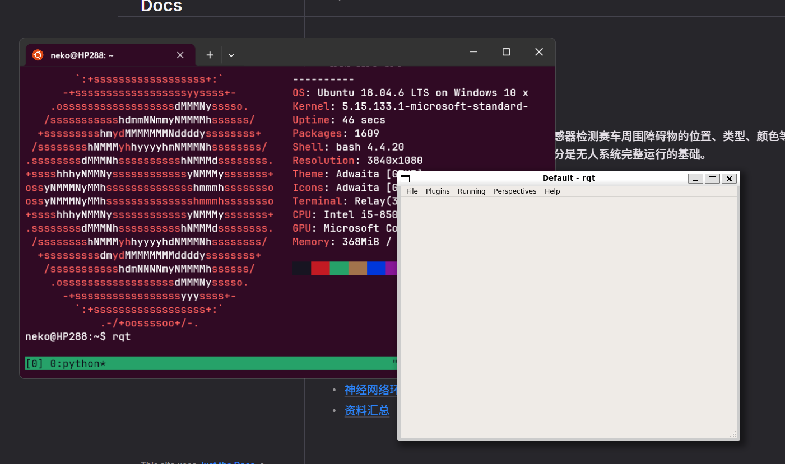
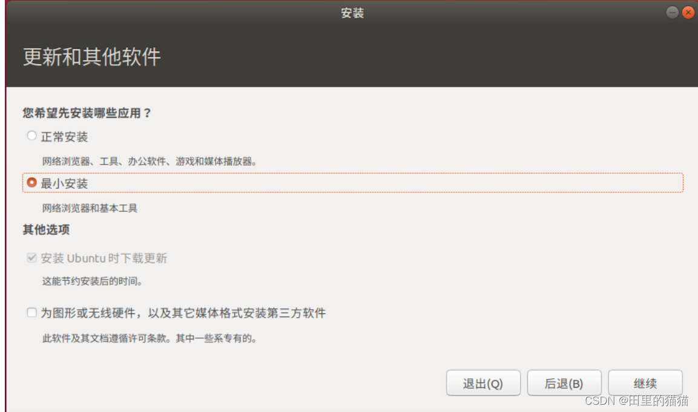

欢迎来到 HUAT FSAC 无人系统部👏，在这里开始你的第一步学习吧。  

:::caution
## 0. 请学会正确的提问

请务必在自行思考，网上寻找仍无法解决之后简明清楚的说明你所遇到的问题。具体请参考[提问的智慧](https://github.com/ryanhanwu/How-To-Ask-Questions-The-Smart-Way/blob/main/README-zh_CN.md)
:::

## 1. 基础环境配置

首先我们从接触全新的系统环境开始,在虚拟机平台上安装Ubuntu,熟悉基本的命令行接口(CLI)操作。  
同时,学习浏览器、集成开发环境(IDE)的安装以及代理的使用。熟练使用命令行是后续工作的基础。

### 1.1 Linux（Ubuntu）系统的安装


要想在 Ubuntu 上进行开发，首先要做的是**安装并配置 Ubuntu 操作系统**。在下方我们给出了两种推荐的基于 Windows 下的虚拟机安装方式。

#### 🌟VMWare

通过 VMWare Workstation 来部署 Ubuntu 虚拟机，你可以参考<https://zhuanlan.zhihu.com/p/38797088>的教程。也可以自行搜索安装教程图文/[视频](https://search.bilibili.com/all?keyword=vmware%20ubuntu%2018.04)。以下是几点提示：

- Ubuntu 系统要求/建议安装为 Ubuntu LTS 18.04，避免对后续操作造成影响；
- VMWare Workstation 的版本并没有严格要求，16/17/18 都是可以的；
- (USTC Mirror) [Ubuntu 18.04.6 镜像](https://mirrors.ustc.edu.cn/ubuntu-releases/18.04.6/ubuntu-18.04.6-desktop-amd64.iso)  （快于官方网站）
- 你可以在[这里](https://www.vmware.com/go/getworkstation-win)下载 VMWare 虚拟机最新版本并进行安装。

#### WSL2

:::warning
此前有过 WSL 上软件图形界面画面撕裂（rqt）的报告，如果你只想尽快配置好，那么请选择 VMware。
:::




Windows Subsystem for Linux (WSL) 是微软在 Windows 10 中引入的一个新功能,它允许在 Windows 系统上原生运行Linux二进制可执行文件,而无需虚拟机或双启动。

WSL的主要功能和优点包括:

1. 在Windows系统内部运行一个真正的Linux环境,包括Linux内核和命令行工具。
2. 无缝地在Windows系统文件和Linux环境文件之间互相访问和操作。
3. 直接在Windows命令行(CMD或PowerShell)中运行Linux命令和程序。

如果你的电脑系统为 Windows 11 或 Windows 10 较新版本且性能配置较高，可以考虑使用 Windows Subsystem for Linux 来创建虚拟机。

相比 VMWare 它具有以下优势：
- 无需 2.xG 的镜像文件
- 启动快
- 安装/卸载方便
- 与 Windows 融合度高
- ...

目前还没有找到适合推荐的 WSL 配置教程，你可以自行参考以下链接来进行 WSL2 Ubuntu 18.04 的安装

[1] <https://zhuanlan.zhihu.com/p/377263437>  
[2] <https://sspai.com/post/74167>  
[3] <https://zhuanlan.zhihu.com/p/348813745>  
[4] <https://blog.csdn.net/qq401195092/article/details/133717025>  
[5] <https://blog.csdn.net/microsoft_mos/article/details/123627295>  

### 1.1.1 Ubuntu 安装后配置

#### 换源

在 Ubuntu 中软件是以“软件包”的形式存在的，而我们想要下载或更新软件就首先要更新软件包列表的索引。考虑到国内与国外原软件分发服务器的网络延迟，更换成在国内架设的“镜像源”显然更为合适。

Ubuntu 的包管  理器是 “apt”，它的“软件源”配置文件在 `/etc/apt/sources.list` 。你可以通过执行 `sudo gedit /etc/apt/sources.list` 来编辑它。

:::tip
你也可以使用[ROS1 (Melodic) 安装教程](./../综合/ros-installing)中的一键脚本来直接设置软件源，避免手动操作。
:::

将打开的文件完全替换为以下的内容：

```text
# 默认注释了源码仓库，如有需要可自行取消注释
deb https://mirrors.ustc.edu.cn/ubuntu/ bionic main restricted universe multiverse
# deb-src https://mirrors.ustc.edu.cn/ubuntu/ bionic main restricted universe multiverse

deb https://mirrors.ustc.edu.cn/ubuntu/ bionic-security main restricted universe multiverse
# deb-src https://mirrors.ustc.edu.cn/ubuntu/ bionic-security main restricted universe multiverse

deb https://mirrors.ustc.edu.cn/ubuntu/ bionic-updates main restricted universe multiverse
# deb-src https://mirrors.ustc.edu.cn/ubuntu/ bionic-updates main restricted universe multiverse

deb https://mirrors.ustc.edu.cn/ubuntu/ bionic-backports main restricted universe multiverse
# deb-src https://mirrors.ustc.edu.cn/ubuntu/ bionic-backports main restricted universe multiverse

```

详细步骤[见此](https://mirrors.ustc.edu.cn/help/ubuntu.html)

### 1.2 Linux 命令行操作

尽管现代 Linux 操作系统大多都搭配的方便易用的 GUI 图形界面，但是对于开发来说快速便捷的 CLI 指令依然是必不可少的得力助手。

#### 我应该在哪里输入命令？

在你已经启动了的 Ubuntu 系统桌面上：

- 按下键盘上的 ctrl 和 alt 和 T 键；
- 按下 windows 键并输入 terminal 最后按回车键；

就会打开 Ubuntu 的命令行窗口，从这里输入你的命令就好。

> 如果你使用 WSL，那么打开的命令窗口就是 Ubuntu 中的终端。

#### 什么是命令，有哪些，我要怎么学习？

由于能力限制，我们无法在这里直接讲述开发中最常见的 Linux 命令以及该如何学习/使用他们。但是可以把[这份教程](https://www.freecodecamp.org/chinese/news/command-line-for-beginners/)推荐给你。

:::tip
另外我们也支持你自己在搜索引擎上搜索不同的 Linux 命令或在虚拟机上亲手看看它们如何工作，毕竟对代码开发的**耐心与兴趣**才是最能保持热情与动力的。
:::

<!-- ### 1.3 浏览器的安装

如果你使用 VMWare 虚拟机来安装 Ubuntu 系统的话，在安装过程中你会注意到这一选项：



选择“最小安装”即可，默认的 Firefox 浏览器会正常进行安装。

但如果使用 WSL 则安装浏览器的意义并不大，因为Windows环境下的浏览器是能直接使用的。  
你可以跳过这一部分，或者在终端中输入 `sudo apt install firefox` 来进行安装。  
-->

### 1.3 IDE（集成开发环境）安装及其配置

在车队目前主要使用 C/C++ 进行开发，部分情况下使用 Python 3。因此我们推荐使用 Visual Studio Code（下称 VSC） 来进行代码教学及日常开发。

#### 安装

> 在[这里](https://vscode.cdn.azure.cn/stable/1a5daa3a0231a0fbba4f14db7ec463cf99d7768e/code_1.84.2-1699528352_amd64.deb)下载 VSCode Linux 安装包（deb）  
> 在[这里](https://vscode.cdn.azure.cn/stable/1a5daa3a0231a0fbba4f14db7ec463cf99d7768e/VSCodeUserSetup-x64-1.84.2.exe)下载 VSCode Windows（exe）

Windows 安装的过程不多复述。

在 Ubuntu 上进行安装首先要找到安装包。接着打开终端，输入：

```bash
sudo dpkg -i {安装包的文件名（带后缀）}
```

进行安装。

在安装过程结束后，你可以通过在终端内执行 `code` 或者在应用列表内找到 VSCode 图标来打开。

#### 安装后配置

参考[这篇教程](./../综合/ros-vsc-setup)来配置在 VSC 上进行 ROS 开发。
参考[这篇教程](./../综合/vsc-c-c++-dev-and-debug)来配置在 VSC 上进行 C/C++ 开发。

### 1.4 Linux 下代理的配置

此部分请移步至[这里](./../综合/setting-up-proxy-on-linux)查看。

## 2. 编程语言基础概念

学习并熟悉C/C++，掌握基础代码查错技巧，了解 cmake 并理解其运行机制。  
C++ 是 ROS 中主要使用的语言,对其有基本的了解非常重要。

### 2.1 基础语言框架

可以在[这里](https://www.runoob.com/cplusplus/cpp-tutorial.html)随时查询相关知识。

### 2.2 cmake

参考 <https://www.hahack.com/codes/cmake/>

## 3. git使用
 
git 是一个分布式的代码版本控制系统。

通过使用 git 你可以将自己的代码随时回退到任意先前版本而不用手动更改任何文件。而且借助 git   的“分支”概念，你可以在不影响主要代码的情况下向代码添加新的功能并测试。  

学习并尝试使用 git 进行代码管理。在 HUAT - FSAC 团队开发项目中，用 git 托管代码是必不可少的。

[在网页上即刻体检 git 操作](https://learngitbranching.js.org/?locale=zh_CN)

关于 git 的详细教程请参考[这个](https://zhuanlan.zhihu.com/p/478860779)。

## 4. ROS 架构熟悉

:::tip[任务]
这一部分指南包含要完成的任务，请认真阅读下列内容并按要求完成任务。
:::

### 4.1 ROS 介绍

ROS 是一个适用于机器人的开源的元操作系统。它提供了操作系统应有的服务，包括硬件抽象，底层设备控制，常用函数的实现，进程间消息传递，以及包管理。 [详情参考](https://wiki.ros.org/cn/ROS/Introduction)

### 4.2 ROS 实践

建议参考[官网的教程](https://wiki.ros.org/cn/ROS/Tutorials)来完成下列任务：

如果遇到未知问题，请首先尝试自行搜索报错信息等。实在无法解决则建议向车队成员寻求帮助。

1. ROS 环境搭建与配置  
    - 安装 ROS **Melodic**  
      安装教程请参考[ROS1 (Melodic) 安装教程](./../综合/ros-installing)
    - 运行 ROS 中内置的 turtle_sim 程序包
    - **完成后上传结果至 QQ 群作业。**
2. 创建自己的 ROS 程序包
    - 在目录下创建 ROS 工作空间； 
    - 创建自己的程序包；
    - 在工作空间中编译运行程序包；
    - 最后截图并上传结果至群作业。

### 4.3 了解 ROS 节点通信

参考以下链接，尝试理解 ROS 节点间是以何种方式实现通信。

[1] <https://wiki.ros.org/cn/ROS/Tutorials/UnderstandingNodes>  
[2] <https://wiki.ros.org/cn/ROS/Tutorials/UnderstandingTopics>  
[3] <https://wiki.ros.org/cn/ROS/Tutorials/WritingPublisherSubscriber%28c%2B%2B%29>

## 5. Github使用 

<!-- 注册 Github 并加入[HUAT-FSAC组织](https://github.com/HUAT-FSAC),可以熟悉/参考车队现有代码。 -->

### 5.1 注册

在[Github 主页](https://github.com)点击右上角的Sign up，随后按照提示完成注册。

<!-- ### 5.2 加入 HUAT-FSAC Github 组织
向 HUAT-FSAC 所有者（[2182998627@qq](https://qm.qq.com/q/Q3p2NrKCOI); 2171139160@qq）告知你的 Github 用户名，之后在[HUAT-FSAC 组织页](https://github.com/HUAT-FSAC)查看来自所有者发送的邀请。 -->


## 6. FSSim

最后尝试运行 [FSSim](https://github.com/HUAT-FSAC/fssim) ,实际操作一个机器人仿真环境,为后续真实机器人做准备。

通过以上学习步骤，你将逐步掌握机器人操作系统ROS的基础知识，为后续的进阶学习奠定坚实基础。实践是提升技能的关键，因此请在学习的同时多进行练习，以加深对所学知识的理解。
