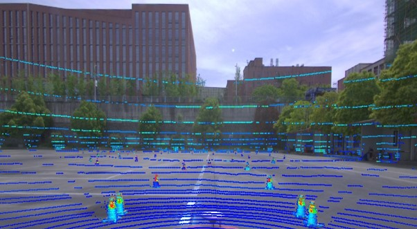

import { Card, CardGrid, Aside, LinkCard, Badge } from '@astrojs/starlight/components';

<CardGrid>
  <Card title="🎯 核心职责" icon="rocket">
    环境感知、目标检测、传感器融合
  </Card>
  <Card title="🔧 主要传感器" icon="setting">
    激光雷达、工业相机、双目相机
  </Card>
  <Card title="📊 输出数据" icon="document">
    锥桶位置、颜色分类、障碍物信息
  </Card>
  <Card title="⚡ 技术栈" icon="laptop">
    ROS、OpenCV、PCL、PyTorch
  </Card>
</CardGrid>

---

## 简介

感知组通过使用**相机**、**激光雷达**等环境感知传感器检测赛车周围障碍物的位置、类型、颜色等信息，同时将处理后的数据下发给各个无人系统。

<Aside type="tip" title="重要性">
  感知部分是无人系统完整运行的**基础**。没有准确的感知数据，后续的规划控制都无法正常工作。
</Aside>

---

## 技术架构

<CardGrid stagger>
  <Card title="激光雷达感知" icon="star">
    - 点云预处理
    - 地面分割
    - 锥桶聚类
    - 位置估计
  </Card>
  <Card title="视觉感知" icon="magnifier">
    - 图像预处理
    - 目标检测 (YOLO)
    - 颜色分类
    - 距离估计
  </Card>
  <Card title="传感器融合" icon="puzzle">
    - 时间同步
    - 空间标定
    - 数据关联
    - 融合输出
  </Card>
</CardGrid>

---

## 理论知识概述

<Aside type="note" title="学习建议">
  建议先掌握基础的机器学习和深度学习知识，再深入学习计算机视觉。
</Aside>

### 推荐学习资源

<CardGrid>
  <LinkCard
    title="那么...什么是卷积"
    description="深入浅出讲解卷积神经网络的核心概念"
    href="https://www.bilibili.com/video/BV1Vd4y1e7pj"
  />
  <LinkCard
    title="激光雷达教程"
    description="激光雷达点云处理入门"
    href="/感知/激光雷达/"
  />
  <LinkCard
    title="摄像头视觉"
    description="工业相机与视觉感知"
    href="/感知/摄像头/"
  />
</CardGrid>

---

## 开发工具

<CardGrid>
  <Card title="ROS" icon="seti:robot">
    <Badge text="必备" variant="success" />
    机器人操作系统，用于节点通信与数据传输
  </Card>
  <Card title="OpenCV" icon="seti:image">
    <Badge text="必备" variant="success" />
    计算机视觉库，图像处理核心工具
  </Card>
  <Card title="PCL" icon="seti:json">
    <Badge text="推荐" variant="note" />
    点云库，激光雷达数据处理
  </Card>
  <Card title="PyTorch" icon="seti:python">
    <Badge text="推荐" variant="note" />
    深度学习框架，目标检测模型训练
  </Card>
</CardGrid>
