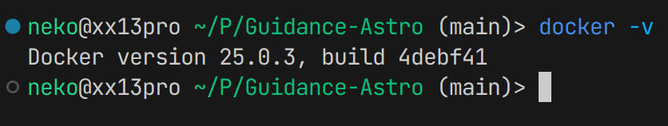
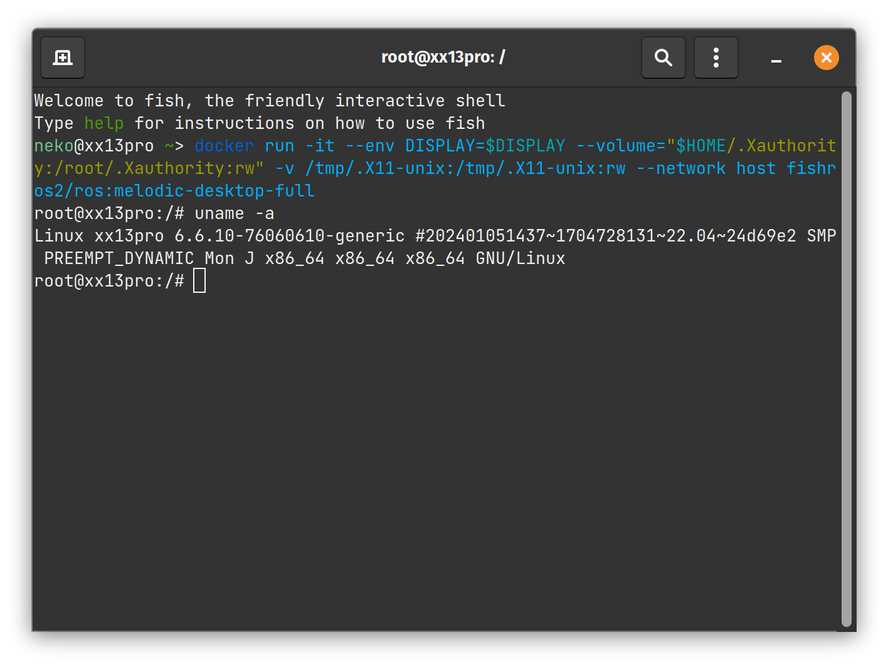
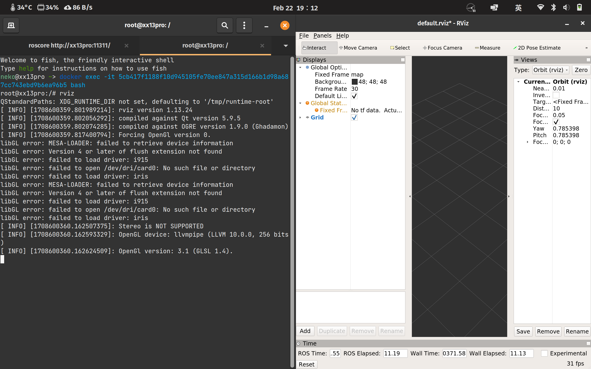

# 前言

ROS 官方严格限制了各 ROS 版本与操作系统间的对应关系。如 ROS1 Melodic 就对应 Ubuntu 18.04 LTS。跨版本的安装是不被鼓励的，你无法在 apt 中找到对应的预编译二进制软件包。（当然你依然可以尝试从 github 克隆代码并手动编译。）

但是依靠 docker，我们可以轻易的获得操作系统/平台依赖无关的 ROS 开发平台。

# 实现

## docker 安装

首先安装 docker，过程不多复述。移步至[官网教程](https://docs.docker.com/desktop/install/linux-install/)以进行安装。

安装完后，可以在终端输入 `docker -v` 来检查，正常情况如图所示。



### docker 后配置

你可能会发现安装后无法执行 docker ps 等命令。  
尝试执行 `sudo usermod -aG docker $USER` 以添加当前用户至 docker 用户组。  

重启后生效。

## 拉取 docker 镜像

在终端执行:

```bash
docker pull fishros2/ros:melodic-dekstop-full
```

拉取过程中可能会有网络问题，请多次尝试，必要时可以使用代理。

## 创建 docker 镜像

```bash
docker run -it --env DISPLAY=$DISPLAY --volume="$HOME/.Xauthority:/root/.Xauthority:rw" -v /tmp/.X11-unix:/tmp/.X11-unix:rw --network host fishros2/ros:melodic-desktop-full
```

执行以上命令，待完成后则默认进入 docker 环境。



尝试执行 `rqt`, `gazebo` 或者 `rviz` 指令来查看 gui 支持是否正常。



## 提示

其他的 docker 命令及教程[见此](https://www.runoob.com/docker/docker-container-usage.html)
如果要开启多个 docker 终端，可在启动