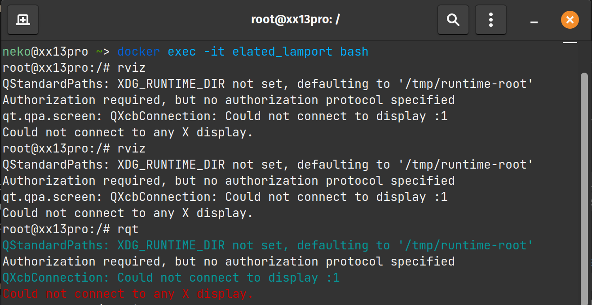
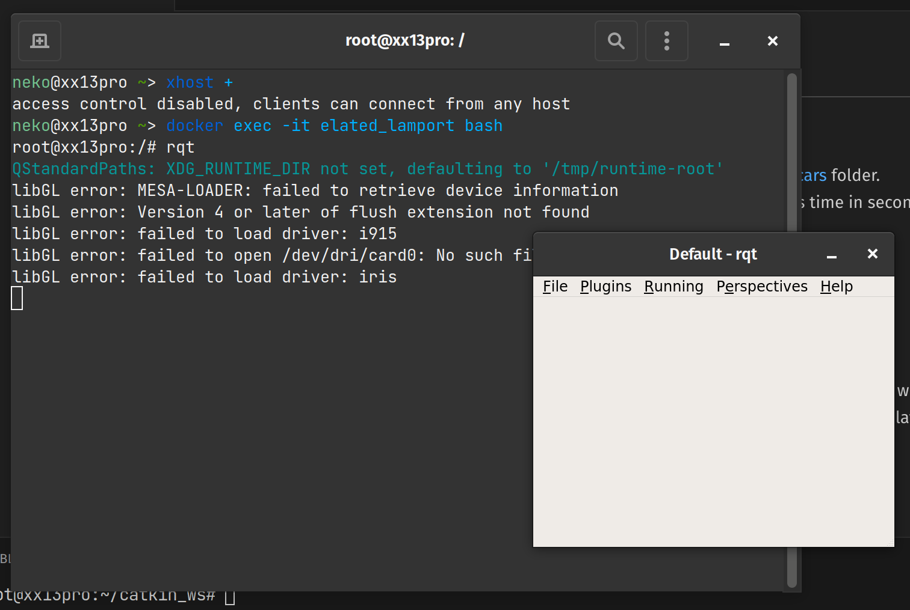

# 前言

ROS 官方严格限制了各 ROS 版本与操作系统间的对应关系。如 ROS1 Melodic 就对应 Ubuntu 18.04 LTS。跨版本的安装是不被支持的，你无法在 apt 中找到对应的预编译二进制软件包。（当然你依然可以尝试从 github 克隆代码并手动编译。）

但是依靠 docker，我们可以实现任意版本的 ROS 安装并且使用其附带的 GUI 工具。如 rqt, gazebo, rqt 等。

# 实现

## 安装前检查

本教程适用于 Linux 系统如 Ubuntu，仅仅为了在不改变系统版本的情况下安装不同版本的 ROS。  
本方法对于 GUI 软件仅适用于使用 Xorg（X11） 的窗口系统，如你使用 Wayland 或者除 Linux 以外的系统，请自行配置 X11 服务。

## docker 安装

首先安装 docker，过程不多复述。移步至[官网教程](https://docs.docker.com/desktop/install/linux-install/)以进行安装。

安装完后，可以在终端输入 `docker -v` 来检查，正常情况如图所示。


### docker 后配置

你可能会发现安装后无法执行 docker ps 等命令。  
尝试执行 `sudo usermod -aG docker $USER` 以添加当前用户至 docker 用户组。  

重启后生效。

## 拉取 docker 镜像

在终端执行:

```bash
docker pull fishros2/ros:melodic-dekstop-full
```

这里默认拉取 ROS1 Melodic 版本，若需要其他版本则可以使用：

1. [默认的 ros 源](https://hub.docker.com/_/ros/tags)
2. [osrf 再分发的 OSS 源](https://hub.docker.com/r/osrf/ros/tags)
3. [fishros2 源](https://hub.docker.com/r/fishros2/ros/tags)

在以上源中找到你所需要版本的特定tag即可。

拉取过程中可能会有网络问题，请多次尝试，必要时可以使用代理。

## 创建 docker 镜像

```bash
docker run -it --env DISPLAY=$DISPLAY --volume="$HOME/.Xauthority:/root/.Xauthority:rw" -v /tmp/.X11-unix:/tmp/.X11-unix:rw --network host fishros2/ros:melodic-desktop-full
```

执行以上命令，待完成后则默认进入 docker 环境。


## 配置 X11 权限

X11 窗口系统默认下采用的安全配置不允许来自 docker 的窗口连接，尝试在 docker 中运行 gui 程序会直接报错。



因此要在本地终端中执行: `xhost +` 从而允许所有的连接。

然后回到在 docker 内的终端，并尝试执行 `rqt`, `gazebo` 或者 `rviz`（需要先启动 `roscore`） 指令来查看 gui 支持是否正常。




## 提示

其他的 docker 命令及教程[见此](https://www.runoob.com/docker/docker-container-usage.html)