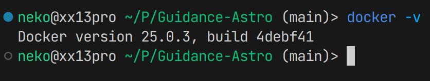

import { Card, CardGrid, Aside, Steps, Badge, LinkCard } from '@astrojs/starlight/components';

<CardGrid>
  <Card title="适用系统" icon="laptop">
    Linux (Ubuntu)
  </Card>
  <Card title="容器技术" icon="seti:docker">
    Docker
  </Card>
  <Card title="GUI 支持" icon="seti:image">
    X11 (Xorg)
  </Card>
  <Card title="难度" icon="star">
    <Badge text="中级" variant="note" />
  </Card>
</CardGrid>

---

## 前言

ROS 官方严格限制了各 ROS 版本与操作系统间的对应关系。如 ROS1 Melodic 就对应 Ubuntu 18.04 LTS。跨版本的安装是不被支持的。

<Aside type="tip" title="Docker 的优势">
  依靠 Docker，我们可以实现**任意版本**的 ROS 安装，并且使用其附带的 GUI 工具，如 rqt、gazebo、rviz 等。
</Aside>

---

## 安装前检查

<Aside type="caution">
  - 本教程适用于 **Linux 系统**（如 Ubuntu）
  - GUI 软件仅适用于使用 **Xorg (X11)** 的窗口系统
  - 如使用 Wayland 或其他系统，请自行配置 X11 服务
</Aside>

---

## Docker 安装

<Steps>

1. **安装 Docker**
   
   移步至 [Docker 官网教程](https://docs.docker.com/desktop/install/linux-install/) 进行安装。

2. **验证安装**
   
   在终端输入 `docker -v` 检查：
   
   

3. **配置用户权限**
   
   如果无法执行 `docker ps` 等命令，执行：
   ```bash
   sudo usermod -aG docker $USER
   ```
   
   <Aside type="note">重启后生效</Aside>

</Steps>

---

## 拉取 Docker 镜像

```bash
docker pull fishros2/ros:melodic-desktop-full
```

<CardGrid>
  <Card title="默认 ROS 源" icon="external">
    [hub.docker.com/_/ros/tags](https://hub.docker.com/_/ros/tags)
  </Card>
  <Card title="OSRF 源" icon="external">
    [hub.docker.com/r/osrf/ros/tags](https://hub.docker.com/r/osrf/ros/tags)
  </Card>
  <Card title="fishros2 源" icon="external">
    [hub.docker.com/r/fishros2/ros/tags](https://hub.docker.com/r/fishros2/ros/tags)
  </Card>
</CardGrid>

<Aside type="tip">
  拉取过程中可能会有网络问题，请多次尝试，必要时可以使用代理。
</Aside>

---

## 创建 Docker 容器

```bash
docker run -it --env DISPLAY=$DISPLAY --volume="$HOME/.Xauthority:/root/.Xauthority:rw" -v /tmp/.X11-unix:/tmp/.X11-unix:rw --network host fishros2/ros:melodic-desktop-full
```

执行以上命令，待完成后则默认进入 Docker 环境。


---

## 配置 X11 权限

X11 窗口系统默认的安全配置不允许来自 Docker 的窗口连接。


<Steps>

1. **在本地终端执行**
   ```bash
   xhost +
   ```
   允许所有连接

2. **在 Docker 内测试 GUI**
   ```bash
   rqt
   # 或
   roscore &
   rviz
   ```

</Steps>

<CardGrid>
  <Card title="rqt 启动成功">
    
  </Card>
  <Card title="rviz 启动成功">
    
  </Card>
</CardGrid>

---

## 相关链接

<CardGrid>
  <LinkCard
    title="Docker 命令教程"
    description="菜鸟教程 - Docker 容器使用"
    href="https://www.runoob.com/docker/docker-container-usage.html"
  />
  <LinkCard
    title="Docker 官方文档"
    description="Docker 官方安装与使用指南"
    href="https://docs.docker.com/"
  />
  <LinkCard
    title="返回综合教程"
    description="查看更多开发环境配置"
    href="/综合/"
  />
</CardGrid>
