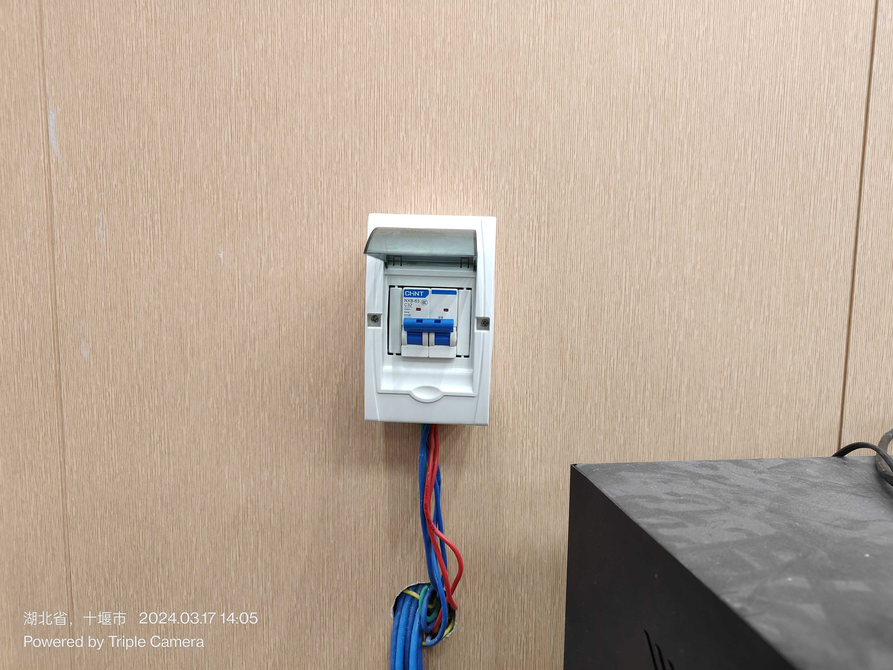
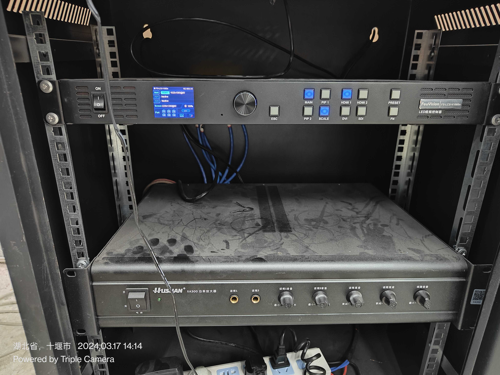
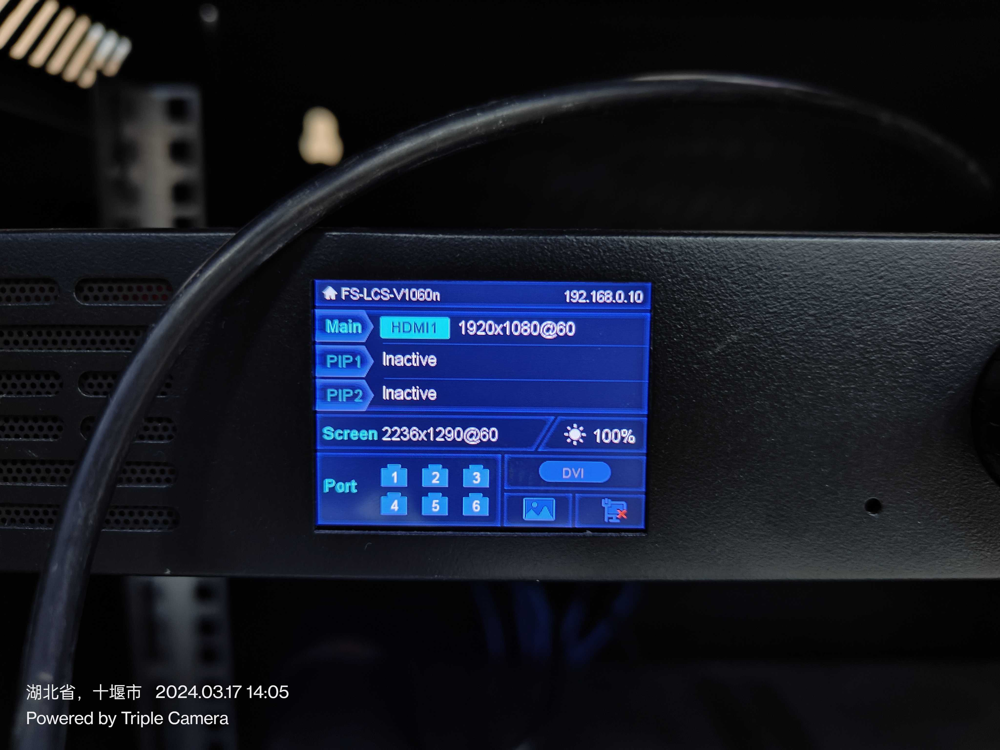

# 电源配置

首先要保证位于一楼大厅右侧的“无标识”空气开关处于打开状态。如打开后立刻跳闸，请无视再次尝试打开即可。
暂不明确该空气究竟控制什么部件。

然后在 LED 控制箱旁找到位于墙上的空气开关，(推荐在)等待完成 LED 控制器启动完成后（见下一步）再打开。

这个开关用于给 LED 屏幕直接供电。

# 启动 LED 控制器

打开 LED 控制器的开关，然后等待启动。如启动失败，则关闭开关并重复该过程直至成功开启。当 LED 控制器上的显示屏显示如图时，则启动完成。

> 注意：底下的 6 个 port 必须亮才说明屏幕已通电。

# 连接外部视频信号

## 使用 5G 投屏器

将投屏器连接至计算器的 USB上，在新弹出的磁盘上安装驱动。

## 使用HDMI直接连接

将本来连接在投瓶路由器上的 HDMI 公口断开，连接到你的设备上即可。
当 LED 控制器屏幕上显示有来自 HDMI1 的信号时则连接正常。