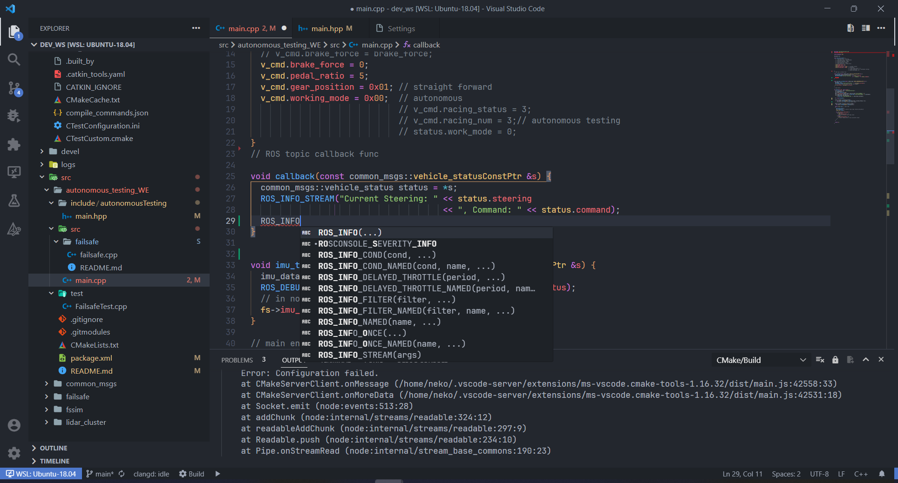

在 VSCode 中标配的 “C/C++” 插件在开发 ROS（C++）上实在显得力不从心。你可能会遇到以下情况：

- 糟糕的头文件索引（CMakeList 写明了是用于编译，而你还需要在 `cpp_configuration` 中添加路径来为 C/C++ 插件提供索引。

- 由于没有良好的索引，静态代码检查完全无法工作

- 完全没有用的 "quick-fix" 只能傻傻的提示一下可能的错误

所以为了提升自己开发 C++ 的体验和节约开发时间，更加推荐使用 clang + clangd 配合 VSC 插件进行开发。

## 安装 clang/clangd “后端”

以 ubuntu 18.04 作为示例，安装可分为以下几步。

1. 安装 clang

    这步并不麻烦，打开终端输入：

    ```bash
    sudo apt install clang
    ```

2. 安装 clangd

    由于 ubuntu 默认的软件源貌似没有提供 clangd 的最新二进制包，只能退而求其次安装 clangd 10。（截至写作时 clangd 的最新版本是 clangd 16）

    ```bash
    sudo apt install clangd-10 （也有 clangd-9 可选）
    ```

    VSCode 所使用的 “clangd” 插件默认寻找 “clangd” 可执行文件，而刚刚安装的是 `clang-10`。  
    这会导致 “clangd” 插件尝试去 llvm 官网下载最新二进制包，对于我们来说是不必要的。因此创建一个软链接将 `clangd-10` 导向 `clangd` 即可。

    ```bash
    sudo ln -s /usr/bin/clangd-10 /usr/bin/clangd
    ```

3. 安装 clang-format

    这步不是必选，但是安装这个后可以在 VSC 中使用 clang 的代码格式化。

    ```bash
    sudo apt install clang-format
    ```

4. 配置 clang-format

    在项目根目录下添加 `.clang-format` 文件，并修改为以下内容。

    ```yaml
    Language:        Cpp

    # BasedOnStyle:  Google

    AccessModifierOffset: -1
    AlignAfterOpenBracket: Align
    AlignConsecutiveAssignments: false
    AlignConsecutiveDeclarations: false
    AlignEscapedNewlines: Left
    AlignOperands:   true
    AlignTrailingComments: true
    AllowAllParametersOfDeclarationOnNextLine: true
    AllowShortBlocksOnASingleLine: false
    AllowShortCaseLabelsOnASingleLine: false
    AllowShortFunctionsOnASingleLine: All
    AllowShortIfStatementsOnASingleLine: true
    AllowShortLoopsOnASingleLine: true
    AlwaysBreakAfterDefinitionReturnType: None
    AlwaysBreakAfterReturnType: None
    AlwaysBreakBeforeMultilineStrings: true
    AlwaysBreakTemplateDeclarations: true
    BinPackArguments: true
    BinPackParameters: true
    BraceWrapping:
    AfterClass:      true
    AfterControlStatement: true
    AfterEnum:       true
    AfterFunction:   true
    AfterNamespace:  false
    AfterObjCDeclaration: false
    AfterStruct:     true
    AfterUnion:      true
    AfterExternBlock: true
    BeforeCatch:     true
    BeforeElse:      true
    IndentBraces:    false
    SplitEmptyFunction: true
    SplitEmptyRecord: true
    SplitEmptyNamespace: true
    BreakBeforeBinaryOperators: None
    BreakBeforeBraces: Custom
    BreakBeforeInheritanceComma: false
    BreakBeforeTernaryOperators: true
    BreakConstructorInitializersBeforeComma: false
    BreakConstructorInitializers: BeforeColon
    BreakAfterJavaFieldAnnotations: false
    BreakStringLiterals: true
    ColumnLimit:     80
    CommentPragmas:  '^ IWYU pragma:'
    CompactNamespaces: false
    ConstructorInitializerAllOnOneLineOrOnePerLine: true
    ConstructorInitializerIndentWidth: 4
    ContinuationIndentWidth: 4
    Cpp11BracedListStyle: true
    DerivePointerAlignment: true
    DisableFormat:   false
    ExperimentalAutoDetectBinPacking: false
    FixNamespaceComments: true
    ForEachMacros:

    - foreach
    - Q_FOREACH
    - BOOST_FOREACH
    IncludeBlocks:   Preserve
    IncludeCategories:
    - Regex:           '^<ext/.*\.h>'
        Priority:        2
    - Regex:           '^<.*\.h>'
        Priority:        1
    - Regex:           '^<.*'
        Priority:        2
    - Regex:           '.*'
        Priority:        3
    IncludeIsMainRegex: '([-_](test|unittest))?$'
    IndentCaseLabels: true
    IndentPPDirectives: None
    IndentWidth:     4
    IndentWrappedFunctionNames: false
    JavaScriptQuotes: Leave
    JavaScriptWrapImports: true
    KeepEmptyLinesAtTheStartOfBlocks: false
    MacroBlockBegin: ''
    MacroBlockEnd:   ''
    MaxEmptyLinesToKeep: 1
    NamespaceIndentation: None
    ObjCBlockIndentWidth: 2
    ObjCSpaceAfterProperty: false
    ObjCSpaceBeforeProtocolList: false
    PenaltyBreakAssignment: 2
    PenaltyBreakBeforeFirstCallParameter: 1
    PenaltyBreakComment: 300
    PenaltyBreakFirstLessLess: 120
    PenaltyBreakString: 1000
    PenaltyExcessCharacter: 1000000
    PenaltyReturnTypeOnItsOwnLine: 200
    PointerAlignment: Right
    RawStringFormats:
    - Delimiter:       pb
        Language:        TextProto
        BasedOnStyle:    google
    ReflowComments:  true
    SortIncludes:    true
    SortUsingDeclarations: true
    SpaceAfterCStyleCast: false
    SpaceAfterTemplateKeyword: true
    SpaceBeforeAssignmentOperators: true
    SpaceBeforeParens: ControlStatements
    SpaceInEmptyParentheses: false
    SpacesBeforeTrailingComments: 1
    SpacesInAngles:  false
    SpacesInContainerLiterals: false
    SpacesInCStyleCastParentheses: false
    SpacesInParentheses: false
    SpacesInSquareBrackets: false
    Standard:        Auto
    TabWidth:        4
    UseTab:          Never
    ```

    这是一份基于 Goolgle 代码规范的格式化标准，做了有关括号位置和缩进大小的自定义修改。你可以在[这里](https://clang.llvm.org/docs/ClangFormatStyleOptions.html)查阅到关于 `clang-format` 的所有设置选项。

## 安装 VSCode 插件

安装以下插件，括号里面的是作者名称，不要下载到错误的插件。

- clangd (LLVM)

- Clang-Format (Xaver Hellauer)

- CMake (twxs)

- CMake Tools (Microsoft)

- CodeLLDB (Vadim Chugunov)


### clangd 设置

在 VSCode 插件中找到 clangd 插件的设置，在“Clangd: Arguments” 中添加：`--compile-commands-dir=${workspaceFolder}/build`
然后保存。  
此配置将会指明编译后文件的存放路径。


### CMake Toools 设置 —— 生成 compile_command.json

**这一步是 clangd 能够自动索引到头文件的关键。**  
同样找到该插件的设置，并将 “Export Compile Commands File” 的选项打上钩。

在工作空间下执行：`catkin config --cmake-args -DCMAKE_EXPORT_COMPILE_COMMANDS=ON`，来设置空间的编译参数。

接着使用 `catkin_make` 或者 `catkin build` 编译一下。


最后在 `/build` 文件夹下看看有没有 `compile_commands.json` 文件的存在。  
如果没有的话，可以从 `build/{正在开发的包名}/` 目录下把 `compile_commands.json` 文件给拷贝到 `build/` 目录下。

## 结语



这样就可以愉快的使用 clangd 的特性进行 ROS 开发了。

## 参考链接

【1】<https://blog.csdn.net/weixin_43862847/article/details/119274382>  
【2】<https://zhuanlan.zhihu.com/p/514541589>  
【3】<https://blog.csdn.net/m0_38144614/article/details/116986927>