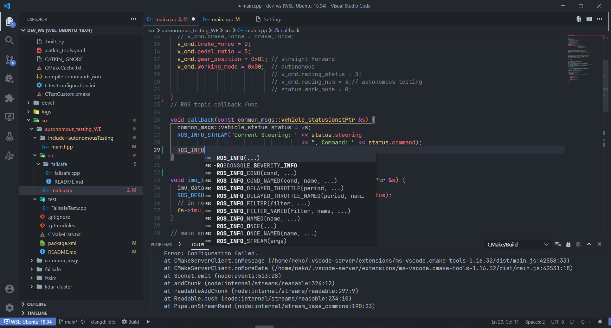

import { Card, CardGrid, Aside, Steps, Badge, LinkCard, Tabs, TabItem } from '@astrojs/starlight/components';

<CardGrid>
  <Card title="编辑器" icon="laptop">
    Visual Studio Code
  </Card>
  <Card title="语言服务" icon="setting">
    clangd (LLVM)
  </Card>
  <Card title="适用系统" icon="seti:ubuntu">
    Ubuntu 18.04+
  </Card>
  <Card title="难度" icon="star">
    <Badge text="中级" variant="note" />
  </Card>
</CardGrid>

---

## 为什么选择 Clangd？

在 VSCode 中的 "C/C++" 插件在开发 ROS（C++）时显得力不从心：

<CardGrid stagger>
  <Card title="❌ 头文件索引差" icon="warning">
    CMakeList 写明了各种库，还需要在 `cpp_configuration` 中手动添加路径
  </Card>
  <Card title="❌ 静态检查失效" icon="warning">
    由于没有良好的索引，静态代码检查完全无法工作
  </Card>
  <Card title="❌ Quick-fix 无用" icon="warning">
    只能傻傻的提示一下可能的错误
  </Card>
</CardGrid>

<Aside type="tip">
  使用 **clang + clangd** 配合 VSCode 插件进行开发，可以大幅提升开发体验和效率！
</Aside>

---

## 安装 Clang/Clangd 后端

以 Ubuntu 18.04 作为示例：

<Steps>

1. **安装 clang**
   ```bash
   sudo apt install clang
   # 考虑到 ubuntu 源更新，其名称可能变为：clang-10
   ```

2. **安装 clangd**
   ```bash
   sudo apt install clangd-10
   ```
   
   创建软链接让 VSCode 插件能找到：
   ```bash
   sudo ln -s /usr/bin/clangd-10 /usr/bin/clangd
   ```

3. **安装 clang-format（可选）**
   ```bash
   sudo apt install clang-format
   ```

</Steps>

---

## 配置 Clang-Format（可选）

在项目根目录下添加 `.clang-format` 文件：

<details>
<summary>点击展开完整配置</summary>

```yaml
Language:        Cpp
AccessModifierOffset: -1
AlignAfterOpenBracket: Align
AlignConsecutiveAssignments: false
AlignConsecutiveDeclarations: false
AlignEscapedNewlines: Left
AlignOperands:   true
AlignTrailingComments: true
AllowAllParametersOfDeclarationOnNextLine: true
AllowShortBlocksOnASingleLine: false
AllowShortCaseLabelsOnASingleLine: false
AllowShortFunctionsOnASingleLine: All
AllowShortIfStatementsOnASingleLine: true
AllowShortLoopsOnASingleLine: true
AlwaysBreakAfterDefinitionReturnType: None
AlwaysBreakAfterReturnType: None
AlwaysBreakBeforeMultilineStrings: true
AlwaysBreakTemplateDeclarations: true
BinPackArguments: true
BinPackParameters: true
BreakBeforeBinaryOperators: None
BreakBeforeBraces: Custom
BreakBeforeInheritanceComma: false
BreakBeforeTernaryOperators: true
BreakConstructorInitializersBeforeComma: false
BreakConstructorInitializers: BeforeColon
BreakAfterJavaFieldAnnotations: false
BreakStringLiterals: true
ColumnLimit:     80
CompactNamespaces: false
ConstructorInitializerAllOnOneLineOrOnePerLine: true
ConstructorInitializerIndentWidth: 4
ContinuationIndentWidth: 4
Cpp11BracedListStyle: true
DerivePointerAlignment: true
DisableFormat:   false
FixNamespaceComments: true
IndentCaseLabels: true
IndentPPDirectives: None
IndentWidth:     4
IndentWrappedFunctionNames: false
KeepEmptyLinesAtTheStartOfBlocks: false
MaxEmptyLinesToKeep: 1
NamespaceIndentation: None
PointerAlignment: Right
ReflowComments:  true
SortIncludes:    true
SortUsingDeclarations: true
SpaceAfterCStyleCast: false
SpaceAfterTemplateKeyword: true
SpaceBeforeAssignmentOperators: true
SpaceBeforeParens: ControlStatements
SpaceInEmptyParentheses: false
SpacesBeforeTrailingComments: 1
SpacesInAngles:  false
SpacesInContainerLiterals: false
SpacesInCStyleCastParentheses: false
SpacesInParentheses: false
SpacesInSquareBrackets: false
Standard:        Auto
TabWidth:        4
UseTab:          Never
```

</details>

<Aside type="note">
  这是一份基于 Google 代码规范的格式化标准。查阅 [Clang-Format 选项文档](https://clang.llvm.org/docs/ClangFormatStyleOptions.html) 了解更多。
</Aside>

---

## 安装 VSCode 插件

<CardGrid>
  <Card title="clangd" icon="star">
    <Badge text="必装" variant="success" />
    作者：LLVM
  </Card>
  <Card title="CMake" icon="puzzle">
    <Badge text="必装" variant="success" />
    作者：twxs
  </Card>
  <Card title="Clang-Format" icon="setting">
    <Badge text="可选" variant="note" />
    作者：Xaver Hellauer
  </Card>
</CardGrid>


---

## 配置 Clangd

<Steps>

1. **设置编译命令路径**
   
   在 VSCode 插件中找到 clangd 设置，在 "Clangd: Arguments" 中添加：
   ```
   --compile-commands-dir=${workspaceFolder}/build
   ```
   
   

2. **配置工作空间编译参数**
   
   <Tabs>
     <TabItem label="catkin build">
       ```bash
       catkin config --cmake-args -DCMAKE_EXPORT_COMPILE_COMMANDS=ON
       catkin build
       ```
     </TabItem>
     <TabItem label="catkin_make">
       ```bash
       catkin_make -DCMAKE_EXPORT_COMPILE_COMMANDS=1
       ```
     </TabItem>
   </Tabs>

3. **验证配置**
   
   检查 `build/` 目录下是否有 `compile_commands.json` 文件。
   
   <Aside type="tip">
     如果文件分散在各包名目录下，可使用 [合并脚本](https://github.com/catkin/catkin_tools/issues/551#issuecomment-553521463) 进行合并。
   </Aside>

</Steps>

---

## 结语



这样就可以愉快地使用 clangd 的特性进行 ROS 开发了！

---

## 参考链接

<CardGrid>
  <LinkCard
    title="Clang-Format 选项"
    description="LLVM 官方文档"
    href="https://clang.llvm.org/docs/ClangFormatStyleOptions.html"
  />
  <LinkCard
    title="catkin_tools Issue"
    description="compile_commands.json 合并方案"
    href="https://github.com/catkin/catkin_tools/issues/551"
  />
  <LinkCard
    title="返回综合教程"
    description="查看更多开发环境配置"
    href="/综合/"
  />
</CardGrid>

