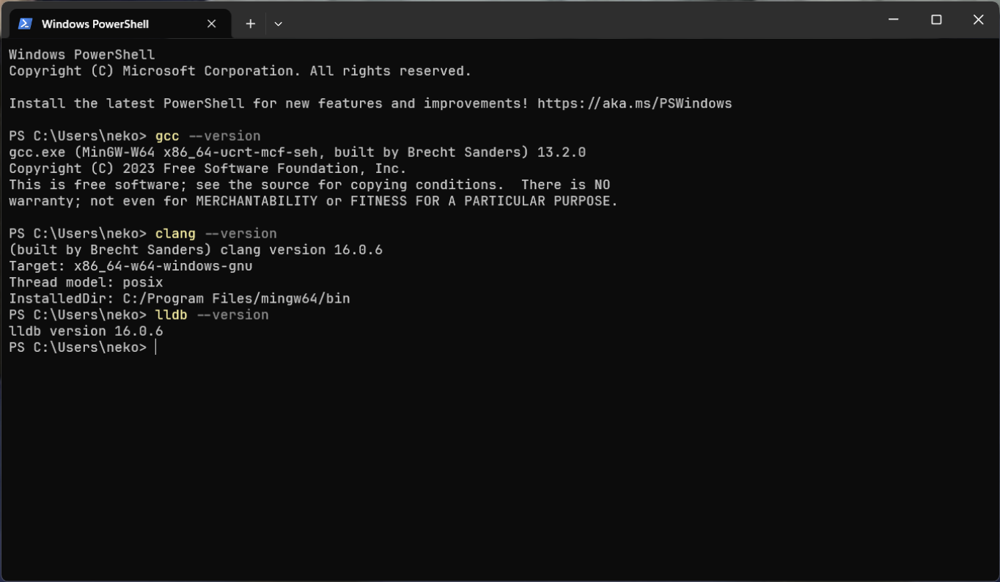
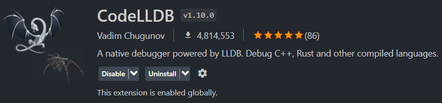
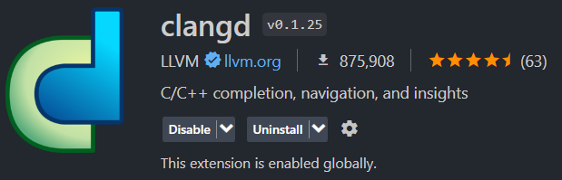

## 前言

VSC 相比 Clion/Visual Studio 来说仅仅是个简单的代码编辑器，默认并不具备 C/C++ 代码的编译/调试等功能。但如果你想要在 VSC 上实现这样的功能的话，你可以参考如下内容进行。

## 安装 Windows 平台下 C/C++ 编译器

在此我推荐 [Winlibs](https://winlibs.com/) 作为 Windows 上最适合使用的编译器。  
它集合了 GCC/Clang 两大编译器，并且整合了 MinGW-w64、LLVM、GDB与LLDB。仅一次安装就可以部署好 C/C++ 编译的大部分软件与环境。

### 部署

在上面的官网下载压缩包，解压后设置系统 PATH 路径至解压后目录的 `/bin` 下。

### 检查

打开 cmd / PowerShell 输入以下命令测试：

```shell
gcc --version
clang++ --version
```



若正常输出 gcc 与 clang 的版本信息即为安装成功。

## 配置 Visual Studio Code 开发环境

在常见的开发印象中，“编译”就应该是有一个对应的按钮🔘来解决的事情。不过在 VSC 中要想实现这一点得提前做点配置。

### 设置 tasks.json

<!-- [官方指南](https://code.visualstudio.com/docs/editor/tasks) -->

task 相当于 VS Code 里面的任务。按下按键所对应的任务便会执行。但在使用这一点来实现一键编译你的程序之前，你需要手动对 `tasks.json` 进行配置。

#### 实操

用 VSC 打开一个你准备好的空目录，新建一个 `.vscode/` 目录，在其中新建一个 `tasks.json` 文件。将以下内容复制进去：

```json
{
    // See https://go.microsoft.com/fwlink/?LinkId=733558
    // for the documentation about the tasks.json format
    "version": "2.0.0", // 指定版本
    "tasks": [
        {
            "label": "Build", // 任务的标签/或者说名称
            "type": "process", // 任务的类型，简的来说不是能在 shell 中完成的都要写成 “process”
            "command": "clang", // 调用编译器的命令
            "args": [ // 编译参数，会自动添加空格跟在 “command” 后面
                "-g", // C/C++ 调试的 flag
                "${file}", // file 变量，相当于目前正在编辑文件的绝对路径
                "-o",
                "${fileBasenameNoExtension}.exe"
                // 如果你正在编辑这个 json 文件而按下 ctrl + shift + b 的时候，编译器就会尝试编译 json 文件而报错。
                // 因此请在 C/C++ 源码编辑界面按下快捷键。
            ],
            "group": { // 指定任务所属的组别
                "kind": "build", // 指定类型
                "isDefault": true // 设置是否为默认
            },
            "problemMatcher": [],
        }
    ]
}
```

完成后在转到代码编辑页面，按下键盘上的 ctrl + shift + B 指定运行默认任务。效果如下图：


有额外的几点要注意，
- 如果你没有使用 Winlibs 那么你可能需要手动指定编译器的绝对路径。
- `${fileBasenameNoExtension}` 属于 VSC 中内置的几个变量之一，你可以在[这里](https://code.visualstudio.com/docs/editor/variables-reference)找到剩下的变量。

### 设置一键调试

#### 安装配套 VSC 插件



首先在 VSC 侧栏里面找到插件页面并安装如图所示的插件，并等待 LLVM 附加包的安装。

#### 配置 `launch.json`

同样地，你需要设置 `launch.json` 来实现传统调试功能。  
在与 `tasks.json` 同样的目录下新添加一个 `launcher.json` 文件，并填入以下内容：

```json
{
    // Use IntelliSense to learn about possible attributes.
    // Hover to view descriptions of existing attributes.
    // For more information, visit: https://go.microsoft.com/fwlink/?linkid=830387
    "version": "0.2.0",
    "configurations": [
        {
            "type": "lldb",
            "request": "launch",
            "name": "Debug",
            "program": "${workspaceFolder}/${fileBasenameNoExtension}.exe",
            "args": [],
            "cwd": "${workspaceFolder}"
        }
    ]
}
```

配置完后，先编译一次，然后在代码页面按下 F5 开始程序调试。

如果调试没有如想象中一样停止等待操作，可以检查 `tasks.json` 中 -g 的 flag 有没有被添加或者尝试在编辑器左侧给程序打上断点。

<!--  -->

## 后话

如果你使用 WinLibs 进行开发，那么我还推荐几个 VSC 插件。

- clangd，配合安装的 clang 前端实时进行静态语法分析与提供编辑时提示。
  
